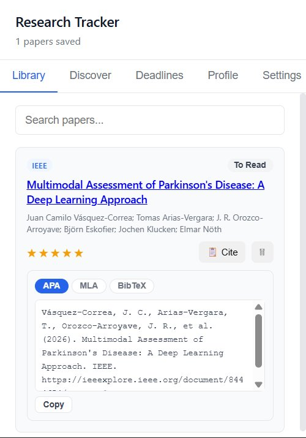
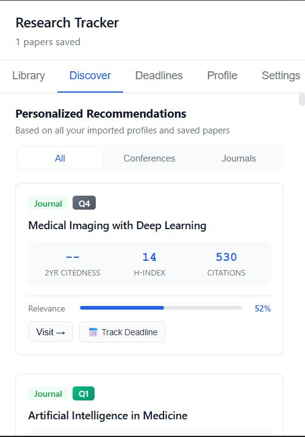
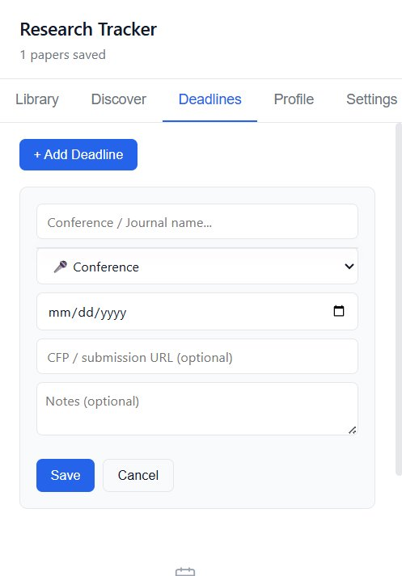
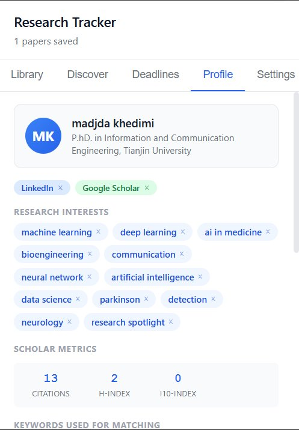

# 📚 Research Tracker

> **Your second brain for academic research**: save papers, track deadlines, and discover the perfect journal to publish in.

[](https://chromewebstore.google.com/detail/research-tracker/noabcbnomflikmeopokbfiibbgiaafih)
[](https://chromewebstore.google.com/detail/research-tracker/noabcbnomflikmeopokbfiibbgiaafih)
[](LICENSE)
[](https://madjdakhedimi.github.io/privacy-policy/)

<br/>

---

## 🎬 See It in Action


<table>
  <tr>
    <td align="center"><b>📚 Library</b></td>
    <td align="center"><b>📡 Discover</b></td>
  </tr>
  <tr>
    <td></td>
    <td></td>
  </tr>
  <tr>
    <td align="center"><b>📅 Deadlines</b></td>
    <td align="center"><b>👤 Profile</b></td>
  </tr>
  <tr>
    <td></td>
    <td></td>
  </tr>
</table>

---

## The Problem with Academic Research

You're 3 papers deep into a rabbit hole on arXiv at midnight, your browser has 47 tabs open, your submission deadline is next Tuesday, and you just realized the journal you've been targeting probably isn't the right fit. Sound familiar?

**Research Tracker was built for exactly this moment.**

---

## 🆕 What's New in v2.3.1

### Library
- **Reading status** on each paper: *To Read*, *Reading*, or *Done*
- **Star ratings** from 1 to 5
- **Copy citation** in APA, MLA, or BibTeX format with one click

### Deadlines
- **Tag each deadline** as Conference, Journal, Workshop, or Other
- **Color-coded urgency**: red under 7 days · orange under 30 · yellow under 60 · green otherwise
- **Live venue suggestions** from DBLP and OpenAlex as you type a conference or journal name
- **WikiCFP integration**: submission deadlines fetched automatically, future dates only
- Every deadline card shows a reminder to verify the date on the official site
- **Track Deadline** button directly on every Discover venue card

### Discover
- Recommendations now factor in both your imported profiles and saved papers
- All API calls run in parallel - results load noticeably faster
- Relevance score reflects how many of your research topics a venue covers

### Profile
- Import from LinkedIn, Google Scholar, and ResearchGate simultaneously - all three sources merge into one profile
- Import buttons always visible so you can add or refresh sources at any time
- After first import, each button links directly to your saved profile page
- **Remove individual imported sources** with one click
- **Remove individual keywords and interests** from the profile card
- Only meaningful research domain terms are stored and shown as keywords

### Content Scripts
- Close button added to the import bar on LinkedIn, Google Scholar, and ResearchGate
- Profile extraction now uses page text instead of DOM class selectors - survives site redesigns

---

## ✨ What It Does

### 🗂️ Paper Library: Never Lose a Paper Again
Browse arXiv and suddenly a notification slides in: *"Paper detected -- save it?"*. One click. Done. Your library grows automatically as you read, with full-text search, custom notes, reading status, star ratings, and instant access to every URL you've ever saved. Copy a citation in APA, MLA, or BibTeX format in one click.

**Supported publishers:**
`arXiv` · `PubMed` · `Nature` · `Science` · `IEEE Xplore` · `Springer` · `Wiley` · `PLOS` · `MDPI` · `ScienceDirect`

### 📡 Discover: AI-Powered Venue Recommendations
This is the secret weapon. Tell Research Tracker your research interests, import your academic profile, and it queries the [OpenAlex](https://openalex.org) database to surface the most relevant journals and conferences for *you*, complete with real metrics:

- **2-year citedness** (impact factor proxy)
- **h-index** and citation counts
- **Quartile ranking** (Q1–Q4, inferred from h-index)
- **Open Access status** and APC costs
- **Indexing** (DOAJ, Scopus, Web of Science)
- **Relevance score** with a live match bar
- **Track Deadline** button on every venue card

The matching algorithm weighs keyword specificity, match breadth, and venue quality. Not just naive string search. All API calls run in parallel for fast results.

### 📅 Deadlines: Submission Anxiety, Managed
Add conference and journal deadlines in two clicks. Tag them as Conference, Journal, Workshop, or Other. Type a venue name and get live suggestions from DBLP and OpenAlex - submission deadlines auto-filled from WikiCFP (future dates only). The extension color-codes urgency: green → yellow → orange → red as the date approaches, with a reminder on every card to verify on the official site. No more missed CFPs.

### 👤 Profile: Import Once, Benefit Forever
Connect your academic identity by visiting your profile on LinkedIn, Google Scholar, or ResearchGate - or all three at once. A floating button appears. Click it and your name, affiliation, research interests, and keywords are extracted locally and stored. Multiple sources merge automatically, with deduplication. Remove individual sources or keywords anytime. These feed directly into the recommendation engine.

You can also manually add interests like `"federated learning"` or `"CRISPR"` and they're weighted in immediately.

---

## 🧠 How the Recommendation Engine Works

```
Your Keywords + Saved Paper Titles + Manual Interests
            ↓
     OpenAlex + DBLP API Queries (parallel)
            ↓
     Match Scoring Algorithm:
     • Exact name match    → 8–10 pts
     • Concept match       → 4–7 pts
     • Anywhere in text    → 2 pts
     • Longer keywords     → 1.3× weight
     • Keyword breadth     → up to 35% boost
     • h-index quality     → up to 1.20× multiplier
     • Citation volume     → up to 1.08× multiplier
     • Open Access         → 1.02× multiplier
            ↓
     Ranked, filterable venue cards with live metrics
```

Results are cached for 24 hours to keep API calls minimal.

---

## 🔒 Privacy-First Architecture

Every byte of your data lives in your browser. Here's the full picture:

| Data | Where it lives | Who can see it |
|---|---|---|
| Saved papers | `chrome.storage.sync` (your device) | Only you |
| Deadlines | `chrome.storage.sync` (your device) | Only you |
| Profile (LinkedIn/Scholar/RG) | `chrome.storage.sync` (your device) | Only you |
| OpenAlex API queries | Anonymous search terms | OpenAlex (no personal info) |

**We have zero servers. We collect zero telemetry. We run zero ads.**

The only outbound requests are anonymous keyword queries to `api.openalex.org` and `dblp.org`: public academic databases. No cookies, no tracking pixels, no analytics scripts.

---

## 🚀 Getting Started

**1. Install** from the [Chrome Web Store](https://chromewebstore.google.com/detail/research-tracker/noabcbnomflikmeopokbfiibbgiaafih)

**2. Visit any paper** on arXiv, PubMed, Nature, etc. A save notification appears automatically

**3. Build your profile** (optional but powerful):
   - Go to your Google Scholar citations page → click **"Import to Research Tracker"**
   - Or visit your LinkedIn/ResearchGate profile and do the same
   - Or just type keywords manually in the **Profile → Manual Interests** section

**4. Open the Discover tab**: personalized journal and conference recommendations, live

**5. Add deadlines** so you never miss a submission window

---

## 📁 Project Structure

```
research-tracker/
├── manifest.json          # Extension config (MV3)
├── popup.html             # Main popup UI
├── popup.js               # Tab navigation, library, deadlines,
│                          # discover engine, recommendation renderer
├── popup.css              # UI styles (clean design system)
├── content.js             # Auto-detects papers on 10+ publishers
├── content.css            # Injected notification / modal styles
├── linkedin.js            # LinkedIn profile extractor
├── scholar.js             # Google Scholar profile extractor
├── researchgate.js        # ResearchGate profile extractor
├── privacy-policy.html    # Full privacy policy
└── icons/
    ├── icon16.png
    ├── icon48.png
    └── icon128.png
```

---

## 🛠️ Technical Highlights

- **Manifest V3**: compliant with Chrome's current extension standard
- **No external dependencies** at runtime: pure vanilla JS, no frameworks
- **Multi-attempt paper detection**: retries at 500ms, 1500ms, and 3000ms to handle slow-loading publishers (looking at you, IEEE)
- **Intelligent profile merging**: importing from multiple sources (Scholar + LinkedIn + ResearchGate) deduplicates and combines keyword arrays
- **Dynamic metrics cache**: OpenAlex responses cached in memory for 24 hours, keyed by venue ID
- **Parallel API calls**: Discover queries run concurrently for faster load times
- **Resilient profile extraction**: uses page text instead of DOM class selectors, survives site redesigns
- **XSS-safe rendering**: all user/API content passed through `escapeHtml()` before DOM insertion
- **Graceful degradation**: if OpenAlex is unreachable, the extension still works; just recommendations won't load

---

## 🌐 Supported Sites

**Auto-save (paper detection):**
`arxiv.org` · `pubmed.ncbi.nlm.nih.gov` · `nature.com` · `science.org` · `ieeexplore.ieee.org` · `link.springer.com` · `onlinelibrary.wiley.com` · `journals.plos.org` · `mdpi.com` · `sciencedirect.com`

**Profile import:**
`linkedin.com/in/*` · `scholar.google.com/citations*` · `researchgate.net/profile/*`

**Data APIs:**
`api.openalex.org` (anonymous, read-only) · `dblp.org` (anonymous, read-only) · `wikicfp.com` (deadline lookup)

---

## 🗺️ Roadmap Ideas

- [ ] Export library to BibTeX / CSV / Zotero-compatible format
- [ ] Browser notifications for approaching deadlines
- [ ] Arxiv category filtering in recommendations
- [ ] Bulk import from `.bib` files
- [ ] Collaboration: share a reading list via URL
- [ ] Dark mode

Have a feature request? Open an issue or reach out on [LinkedIn](https://www.linkedin.com/in/madjda-khedimi-336154162/).

---

## 👩‍💻 Author

**Madjda Khedimi**
[LinkedIn](https://www.linkedin.com/in/madjda-khedimi-336154162/) · [Chrome Web Store](https://chromewebstore.google.com/detail/research-tracker/noabcbnomflikmeopokbfiibbgiaafih)

---

## 📄 License

MIT: do whatever you want, just keep the attribution.

---

<div align="center">

**If Research Tracker saved you time, consider leaving a ⭐ review on the [Chrome Web Store](https://chromewebstore.google.com/detail/research-tracker/noabcbnomflikmeopokbfiibbgiaafih): it helps other researchers find it.**

</div>
