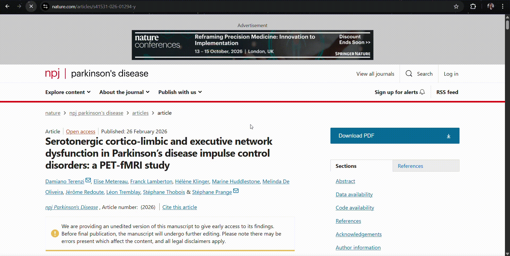
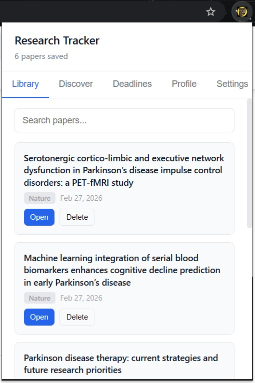
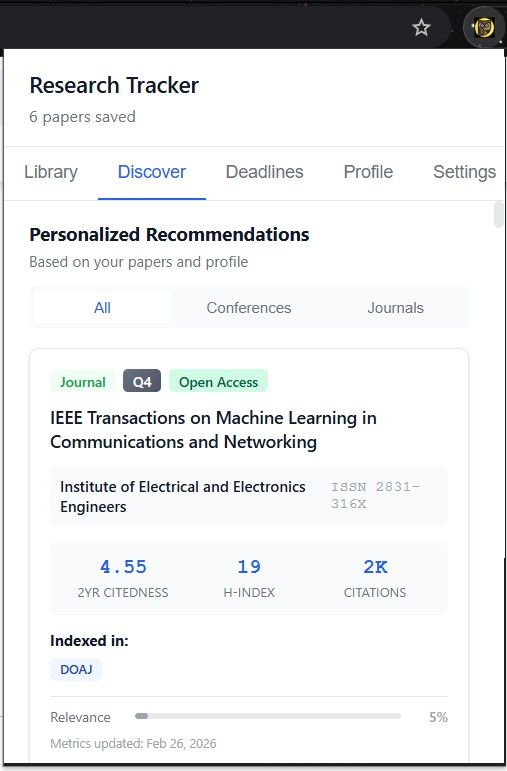

# 📚 Research Tracker

> **Your second brain for academic research**: save papers, track deadlines, and discover the perfect journal to publish in.

[](https://chromewebstore.google.com/detail/research-tracker/noabcbnomflikmeopokbfiibbgiaafih)
[](https://chromewebstore.google.com/detail/research-tracker/noabcbnomflikmeopokbfiibbgiaafih)
[](LICENSE)
[](https://madjdakhedimi.github.io/privacy-policy/)

<br/>



---

## The Problem with Academic Research

You're 3 papers deep into a rabbit hole on arXiv at midnight, your browser has 47 tabs open, your submission deadline is next Tuesday, and you just realized the journal you've been targeting probably isn't the right fit. Sound familiar?

**Research Tracker was built for exactly this moment.**

---

## ✨ What It Does

### 🗂️ Paper Library: Never Lose a Paper Again
Browse arXiv and suddenly a notification slides in: *"Paper detected -- save it?"*. One click. Done. Your library grows automatically as you read, with full-text search, custom notes, and instant access to every URL you've ever saved.

**Supported publishers:**
`arXiv` · `PubMed` · `Nature` · `Science` · `IEEE Xplore` · `Springer` · `Wiley` · `PLOS` · `MDPI` · `ScienceDirect`



### 📡 Discover: AI-Powered Venue Recommendations
This is the secret weapon. Tell Research Tracker your research interests, import your academic profile, and it queries the [OpenAlex](https://openalex.org) database to surface the most relevant journals and conferences for *you*, complete with real metrics: with real metrics:

- **2-year citedness** (impact factor proxy)
- **h-index** and citation counts
- **Quartile ranking** (Q1–Q4, inferred from h-index)
- **Open Access status** and APC costs
- **Indexing** (DOAJ, Scopus, Web of Science)
- **Relevance score** with a live match bar

The matching algorithm weighs keyword specificity, match breadth, and venue quality. Not just naive string search.



### 📅 Deadlines: Submission Anxiety, Managed
Add conference and journal deadlines in two clicks. The extension color-codes urgency: upcoming deadlines get flagged, overdue ones turn red, and today's deadlines scream *"Due today!"*. No more missed CFPs.

### 👤 Profile: Import Once, Benefit Forever
Connect your academic identity by visiting your profile on LinkedIn, Google Scholar, or ResearchGate. A floating button appears. Click it and your name, affiliation, research interests, and keywords are extracted locally and stored. These feed directly into the recommendation engine.

You can also manually add interests like `"federated learning"` or `"CRISPR"` and they're weighted in immediately.

---

## 🧠 How the Recommendation Engine Works

```
Your Keywords + Saved Paper Titles + Manual Interests
            ↓
     OpenAlex API Query
     (journals + conferences)
            ↓
     Match Scoring Algorithm:
     • Exact name match    → 8–10 pts
     • Concept match       → 4–7 pts
     • Anywhere in text    → 2 pts
     • Longer keywords     → 1.3× weight
     • Keyword breadth     → up to 35% boost
     • h-index quality     → up to 1.20× multiplier
     • Citation volume     → up to 1.08× multiplier
     • Open Access         → 1.02× multiplier
            ↓
     Ranked, filterable venue cards with live metrics
```

Results are cached for 24 hours to keep API calls minimal.

---

## 🔒 Privacy-First Architecture

Every byte of your data lives in your browser. Here's the full picture:

| Data | Where it lives | Who can see it |
|---|---|---|
| Saved papers | `chrome.storage.sync` (your device) | Only you |
| Deadlines | `chrome.storage.sync` (your device) | Only you |
| Profile (LinkedIn/Scholar/RG) | `chrome.storage.sync` (your device) | Only you |
| OpenAlex API queries | Anonymous search terms | OpenAlex (no personal info) |

**We have zero servers. We collect zero telemetry. We run zero ads.**

The only outbound request is an anonymous keyword query to `api.openalex.org`: a public academic database. No cookies, no tracking pixels, no analytics scripts.

---

## 🚀 Getting Started

**1. Install** from the [Chrome Web Store](https://chromewebstore.google.com/detail/research-tracker/noabcbnomflikmeopokbfiibbgiaafih)

**2. Visit any paper** on arXiv, PubMed, Nature, etc. A save notification appears automatically

**3. Build your profile** (optional but powerful):
   - Go to your Google Scholar citations page → click **"Import to Research Tracker"**
   - Or visit your LinkedIn/ResearchGate profile and do the same
   - Or just type keywords manually in the **Profile → Manual Interests** section

**4. Open the Discover tab**: personalized journal and conference recommendations, live

**5. Add deadlines** so you never miss a submission window

---

## 📁 Project Structure

```
research-tracker/
├── manifest.json          # Extension config (MV3)
├── popup.html             # Main popup UI
├── popup.js               # Tab navigation, library, deadlines,
│                          # discover engine, recommendation renderer
├── popup.css              # UI styles (clean design system)
├── content.js             # Auto-detects papers on 10+ publishers
├── content.css            # Injected notification / modal styles
├── linkedin.js            # LinkedIn profile extractor
├── scholar.js             # Google Scholar profile extractor
├── researchgate.js        # ResearchGate profile extractor
├── privacy-policy.html    # Full privacy policy
└── icons/
    ├── icon16.png
    ├── icon48.png
    └── icon128.png
```

---

## 🛠️ Technical Highlights

- **Manifest V3**: compliant with Chrome's current extension standard
- **No external dependencies** at runtime: pure vanilla JS, no frameworks
- **Multi-attempt paper detection**: retries at 500ms, 1500ms, and 3000ms to handle slow-loading publishers (looking at you, IEEE)
- **Intelligent profile merging**: importing from multiple sources (Scholar + LinkedIn) deduplicates and combines keyword arrays
- **Dynamic metrics cache**: OpenAlex responses cached in memory for 24 hours, keyed by venue ID
- **XSS-safe rendering**: all user/API content passed through `escapeHtml()` before DOM insertion
- **Graceful degradation**: if OpenAlex is unreachable, the extension still works; just recommendations won't load

---

## 🌐 Supported Sites

**Auto-save (paper detection):**
`arxiv.org` · `pubmed.ncbi.nlm.nih.gov` · `nature.com` · `science.org` · `ieeexplore.ieee.org` · `link.springer.com` · `onlinelibrary.wiley.com` · `journals.plos.org` · `mdpi.com` · `sciencedirect.com`

**Profile import:**
`linkedin.com/in/*` · `scholar.google.com/citations*` · `researchgate.net/profile/*`

**Data API:**
`api.openalex.org` (anonymous, read-only)

---

## 🗺️ Roadmap Ideas

- [ ] Export library to BibTeX / CSV / Zotero-compatible format
- [ ] Browser notifications for approaching deadlines
- [ ] Arxiv category filtering in recommendations
- [ ] Bulk import from `.bib` files
- [ ] Collaboration: share a reading list via URL
- [ ] Dark mode

Have a feature request? Open an issue or reach out on [LinkedIn](https://www.linkedin.com/in/madjda-khedimi-336154162/).

---

## 👩‍💻 Author

**Madjda Khedimi**
[LinkedIn](https://www.linkedin.com/in/madjda-khedimi-336154162/) · [Chrome Web Store](https://chromewebstore.google.com/detail/research-tracker/noabcbnomflikmeopokbfiibbgiaafih)

---

## 📄 License

MIT: do whatever you want, just keep the attribution.

---

<div align="center">

**If Research Tracker saved you time, consider leaving a ⭐ review on the [Chrome Web Store](https://chromewebstore.google.com/detail/research-tracker/noabcbnomflikmeopokbfiibbgiaafih): it helps other researchers find it.**

</div>
